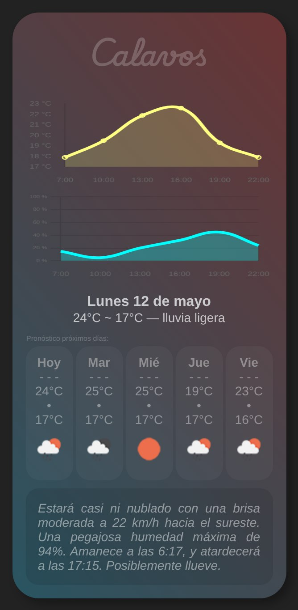
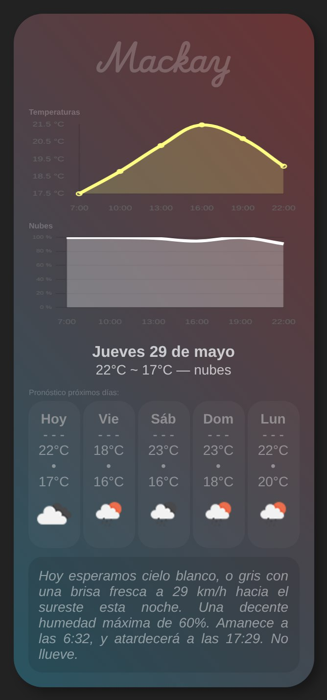

# pronostiCard
What I use in my AI (Artificial Idiot) to get the weather of my, or any location.


Here I apply API requests, data preprocessing and transformation, HTML parsing and generation, pythonic elegance, and asthetic sence of design.

# Usage

Since the package is called _pronos_, we call the
function _tico_, forming then the word _pronos.tico_, meaning _forecast_ in spanish. I speak Spanish.

```python
import pronos

pronos.tico(chat_id = 7654321, lugar = 'byron bay')
```
The _chat_id_ argument is used to compare the location given by the API with the one saved for the user, if _location_ is not given. That way it returns the name of the location better, because sometimes de API fails with nameing.


## Process...


It checks if the input _lugar_ (place) is a name or the coordinates of some place, and continues by calling the function related to the API of OpenWeatherMap:

```python
jsonData = obtener_pronostico(location = lugar)
```

or

```python
float: lat = -21.1408
float: lon = 149.1851

jsonData = obtener_pronostico(coodinates = (lat, lon))
```

it proceeds by calling the class **Owo** to clean the data getting the forcast of today and the next 5 days:

```python
owo = Owo(jsonData)

datosDia = owo.arreglo_del_dia()
datos5Dias = owo.arreglo_5_dias()
```
Inside the functions it goes through a probability analysis to produce the texts of the forecast, picking randomly one of the options, to make the text feel more natural. As the follow shows:

```python
def prob_a_palabra(val: int) -> str:
    if val <= 10:
        return rc(['despejado', 'claro', 'sin nubes'])
    elif val <= 30:
        return rc(['con un par de nubecitas', 'casi ni nublado'])
    elif val <= 60:
        return rc(['un poco nublado', 'algo nublado', 'nubladito'])
    else:
        return rc(['nublado', 'muy nublado', 'tapado en nubes', 'blanco, o gris'])
```

The Icon is selected by getting the different forecasts of the day and deciding what's the important issue. It does it in the functions **_icon** with **_llueve**, having as hierarchy: day-rain, night-rain, day-clouds, sunny, ...   

Now it proceeds by creating the HTML script, and take the screenshot of the card:

```python
html = generar_html(dataDia=datosDia, data5dias=datos5Dias)

sacar_screenshot(html=html)
```


For future updates I'm thinking on adding a random "theme" picker, to make the colors more dynamic.

## Result

<p align="center">
  
</p>

<p align="center">
  
</p>

<p align="center">
  
</p>

<p align="center">
  
</p>


Very cloudy at Mackay as we can see.

## Features

- **Considers Uslessness of Data**: If the average of the probabilty of rain is 0, it changes the second graph
showing the percentage of clouds instead.
- **Redaction**: It gets random generated responses explaining the weather to give it a more natural feeling.
- **Beautiful**: Nice colors.


## Contributions

Contributions are welcome! If you have improvements or fixes, please send a pull request or open an issue in the GitHub repository.

## License

This project is licensed under the MIT License. Do whatever you want.

## Contact

Nico Spok - nicospok@proton.me
GitHub: niCodeLine
